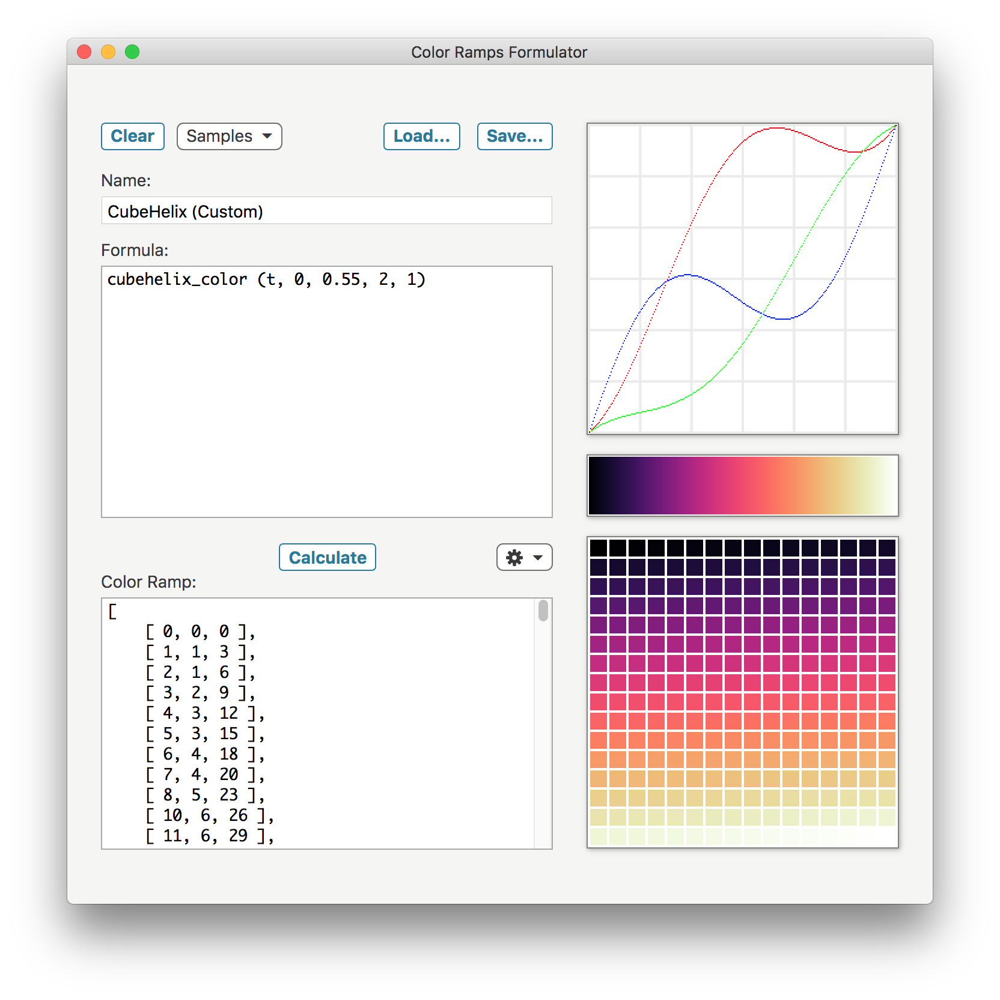

#  COLOR RAMPS FORMULATOR

**Color Ramps Formulator** is a desktop application used to generate algorithmically-defined color ramps.

This application is built with [Electron](https://electronjs.org), and works on macOS, Linux and Windows operating systems.

## Features

**[TBD]**

**Note**: This is currently a beta release: please refer to the document [CHANGES.md](CHANGES.md) for more details.



## Building

You'll need [Node.js](https://nodejs.org) installed on your computer in order to build this application.

```bash
git clone https://github.com/tonton-pixel/color-ramps-formulator
cd color-ramps-formulator
npm install
npm start
```

If you don't wish to clone, you can [download the source code](https://github.com/tonton-pixel/color-ramps-formulator/archive/master.zip).

Several scripts are also defined in the `package.json` file to build OS-specific bundles of the app, using the simple yet powerful [Electron Packager](https://github.com/electron-userland/electron-packager) Node module.\
For instance, running the following command will create a `Color Ramps Formulator.app` version for macOS:

```bash
npm run build-darwin
```

## Using

~~You can [download the latest release](https://github.com/tonton-pixel/color-ramps-formulator/releases) for macOS.~~

## License

The MIT License (MIT).

Copyright © 2020 Michel MARIANI.
