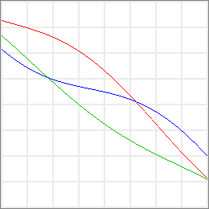
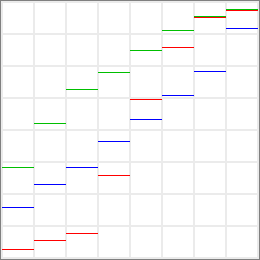
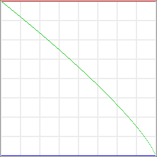

#  COLOR RAMP FORMULATOR

**Color Ramp Formulator** is an open-source desktop application used to generate algorithmically-defined **color ramps**, making use of **formulas**.

This application is built with [Electron](https://www.electronjs.org/), and works on macOS, Linux and Windows operating systems.


## Examples

### CubeHelix (Destiny)

<p></p>
<p></p>

```javascript
cubehelix_color (1 - t, 0, 0.4, 0.8, 1, [ 0.15, 0.85 ])
```

### Diverging

<p></p>
<p></p>

```javascript
rgb_t
(
    cos ((t - 2/6) * PI),
    cos ((t - 3/6) * PI),
    cos ((t - 4/6) * PI)
)
```

### Fancy (Ternary)

<p></p>
<p></p>

```javascript
rgb
(
    (x < 127.5) ? 255 - (2 * x) : (2 * x) - 255,
    (x < 127.5) ? 1.5 * x : 127.5 + (0.5 * x),
    (x < 127.5) ? 127.5 + (0.5 * (255 - x)) : 1.5 * (255 - x)
)
```

### Green Sequential (Discrete)

<p></p>
<p></p>

```javascript
discrete_colors
(
    [
        "#085A32",
        "#118649",
        "#18A85A",
        "#52B974",
        "#9ECF8A",
        "#D2E3A2",
        "#F0F1BA",
        "#F7F8E5"
    ],
    [ 0, 255 ], x
)
```

### Iron (YCbCr)

<p></p>
<p></p>

```javascript
ycbcr_t
(
    lerp (0.059, 0.886, t),
    cubic ([ 5.99477, -8.68926, 2.53768, 0.550188 ], t),
    cubic ([ 0.683558, -2.49828, 1.94276, 0.383144 ], t)
)
```

### Navajo White (Transformed)

<p></p>
<p></p>

```javascript
transform_color
(
    "navajo_white",
    0, lerp (1, 2, t), lerp (1, 1/3, t)
)
```

### Parakeet (CubeHelix)

<p></p>
<p></p>

```javascript
interpolate_colors
(
    [
        [ 0/3, cubehelix (260, 60, 35) ],
        [ 2/3, cubehelix (80, 120, 75) ],
        [ 3/3, "gold" ]
    ],
    t,
    "cubehelix-dec", [ 100, 0, 0 ]
)
```

### Radiancy (HSL)

<p></p>
<p></p>

```javascript
distribute_colors
(
    [ "#2A4858", "#FAFA6E", "#2A4858" ],
    [ 0, 1 ], t,
    "hsl-far", [ 0, 100, 0 ]
)
```

### Two-Sided Color Bar

<p></p>
<p></p>

```javascript
hsv
(
    t < 0.5 ? lerp (240, 120, t) : lerp (60, -60, t - 0.5),
    100,
    100
)
```

### Yellow to Blue

<p></p>
<p></p>

```javascript
hcl_t
(
    1/9 + 1/6 + (t / 2),
    0.5,
    1 - pow (t, 1.5)
)
```

### Yellow to Red (Wavelengths)

<p></p>
<p></p>

```javascript
wavelength_color (lerp (580, 645, t))
```

## Using

You can [download the latest release](https://github.com/tonton-pixel/color-ramp-formulator/releases) for macOS.

## Building

You'll need [Node.js](https://nodejs.org/) (which comes with [npm](https://www.npmjs.com/)) installed on your computer in order to build this application.

### Clone method

```bash
# Clone the repository
git clone https://github.com/tonton-pixel/color-ramp-formulator
# Go into the repository
cd color-ramp-formulator
# Install dependencies
npm install
# Run the application
npm start
```

**Note**: to use the clone method, the core tool [git](https://www.git-scm.com/) must also be installed.

### Download method

If you don't wish to clone, you can [download the source code](https://github.com/tonton-pixel/color-ramp-formulator/archive/master.zip), unZip it, then directly run the following commands from a Terminal opened at the resulting `color-ramp-formulator-master` folder location:

```bash
# Install dependencies
npm install
# Run the application
npm start
```

### Packaging

Several scripts are also defined in the `package.json` file to build OS-specific bundles of the application, using the simple yet powerful [Electron Packager](https://github.com/electron-userland/electron-packager) Node module.\
For instance, running the following command (once the dependencies are installed) will create the `Color Ramp Formulator.app` version for macOS:

```bash
# Build macOS (Darwin) application
npm run build-darwin
```

## License

The MIT License (MIT).

Copyright © 2020 Michel Mariani.
